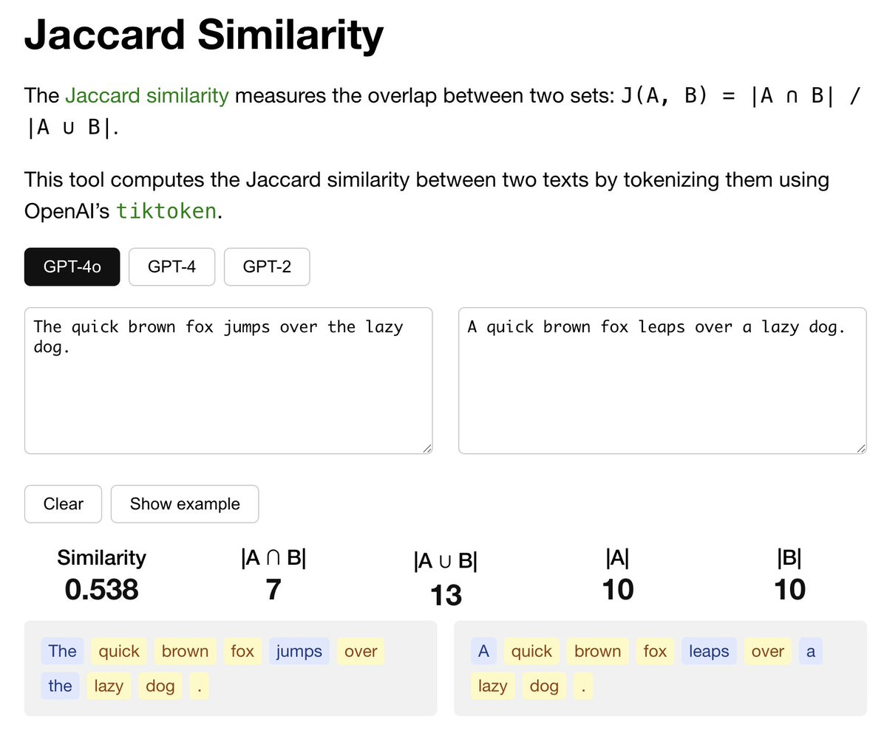

# Jaccard Similarity

A simple web app to compute [Jaccard similarity](https://en.wikipedia.org/wiki/Jaccard_index) between two texts by tokenizing them using OpenAI's [tiktoken](https://github.com/openai/tiktoken).





## Test
```bash
npm install
npm run start
```

## Deploy
```bash
npm run build
npm run deploy
```

## Acknowledgements
This app is inspired by OpenAI's Tokenizer demo site: https://platform.openai.com/tokenizer.
